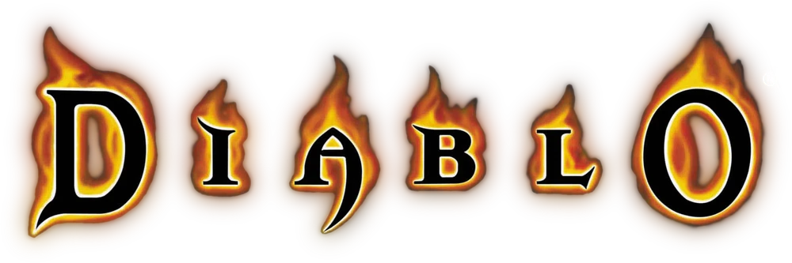

  

Bem-vindo ao **Diablo RPG** — um sistema de RPG de mesa homebrew inspirado na franquia Diablo, criado por Paulo Souza. O jogo coloca os heróis no papel de Nephalem enfrentando as hordas do Inferno Ardente em Santuário, com turnos rápidos, decisões claras e uma dificuldade que emula o modo Hardcore dos jogos.

O sistema é baseado em mecânicas d20/Shadowdark e abrange 18 classes, regras de combate ágeis com Pontos de Ação, um sistema de Mana, resistências por tipo de dano e uma progressão de nível 1 a 10.

---

## Seções

- **[Livro do Jogador](jogador/introducao.md)** — Introdução, regras de jogo, arsenal, resistências, criação de personagem, origens e talentos
- **[Classes](classes/index.md)** — As 18 classes de Santuário
- **[Livro do Mestre](mestre/encontros.md)** — Encontros, tesouros, registro de campanha e template de cenário
- **[Criaturas](criaturas.md)** — Apêndice A: Bestiário
- **[Glossário](glossario.md)** — Apêndice B: Termos e definições
